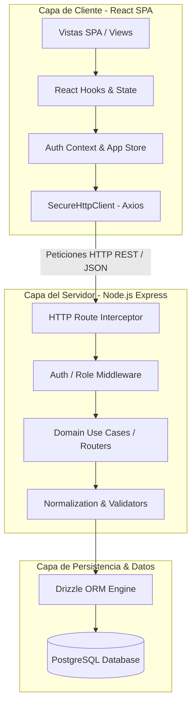
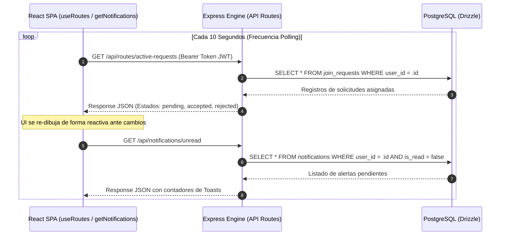
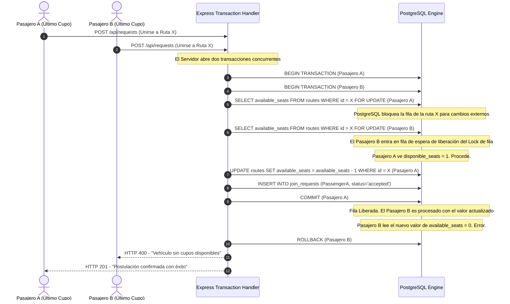

# 🚗 01 - RIVO: Arquitectura General del Sistema

Este documento describe la arquitectura global, el flujo macro, el ecosistema técnico, los canales de datos y las salvaguardas transaccionales que integran a **Rivo** en su operación unificada con base de datos PostgreSQL.

---

## 📐 1. Diagrama de Capas de Rivo

El siguiente esquema muestra el desacoplamiento de capas del monolito desde la interfaz en React SPA hasta el motor relacional de datos:

---

## 🔄 2. Flujo Macro de Comunicación y Sincronización

La sincronización de la plataforma opera mediante un **Polling Centralizado** en el frontend que mantiene el estado actualizado de uniones, alertas y viajes sin incurrir en deudas técnicas de conectividad de sockets en infraestructuras restringidas.

---

## 🔒 3. Control de Condiciones de Carrera (Race Conditions)

En sistemas de alta demanda de movilidad, la sobreventa de cupos es una falla que Rivo erradica mediante bloqueos de fila a nivel relacional en PostgreSQL.

### Explicación del Blindaje Transaccional:
1.  **`FOR UPDATE`:** Esta directiva bloquea las tuplas seleccionadas de la tabla `routes` hasta que termine la transacción en curso.
2.  **Aislamiento:** Evita lecturas sucias (*dirty reads*), garantizando que si dos peticiones entran con milisegundos de diferencia para el último asiento libre, sólo una de ellas alcance a decretar la confirmación del viaje.
