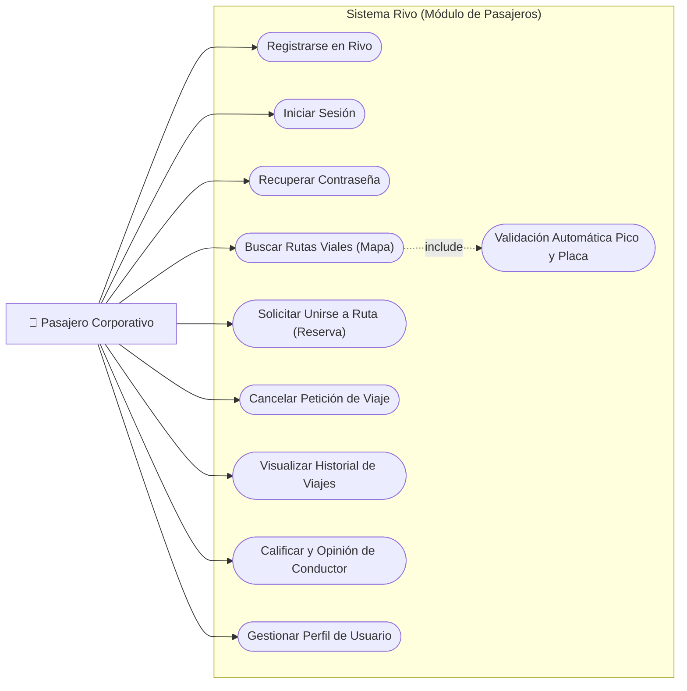

# 👥 Casos de Uso del Rol - Pasajero (Passenger)

Este documento especifica de forma formal y visual los límites y acciones que posee un colaborador corporativo que navega bajo el
 rol de **Pasajero** de Rivo.

---

## 🎭 1. Casos de Uso de Pasajero en Rivo

---

## 📋 2. Detalle de Casos de Uso Críticos

### UC-PAS-01: Buscar Rutas Viales (Mapa)
*   **Actor Principal:** Pasajero Corporativo.
*   **Precondiciones:** El pasajero debe contar con un token JWT de sesión válido (`authenticated`).
*   **Efecto en Sistema:** Consume base de datos de rutas (`routes`) filtrando tránsitos activos. Presenta las coordenadas geográficas
 de los puntos en el `MapContainer` interactivo de Google Maps.
*   **Explicación:** El pasajero introduce origen/destino mediante el predictor web (Autocompletado de Places) para delimitar el mapa.

### UC-PAS-02: Solicitar Unirse a Ruta (Reserva)
*   **Actor Principal:** Pasajero Corporativo.
*   **Precondiciones:** La ruta debe tener asientos disponibles (`available_seats > 0`) y no poseer conflictos de horarios concurrentes
 para el pasajero.
*   **Flujo Principal:** 
    1. El pasajero selecciona el trayecto y presiona "Solicitar unirse".
    2. El sistema instrumenta una transacción atómica para persistir la solicitud en estado `pending` en la tabla `join_requests`.
    3. Se despacha alerta Toast y notificación de bandeja física al conductor responsable.
*   **Excepciones:** El sistema bloquea si el usuario ya se postuló o si la ruta ha cambiado a estado `in_progress` o `completed`.

### UC-PAS-03: Calificar y Opinión de Conductor
*   **Actor Principal:** Pasajero Corporativo.
*   **Precondiciones:** El viaje en el que participó activamente debe estar en estado `completed` (Reconciliación JIT temporal completada).
*   **Efecto en Sistema:** El pasajero ingresa puntuación (1 a 5 estrellas) y opcionalmente texto descriptivo. Persiste en `reviews` y
 actualiza la reputación agregada del chofer en su perfil corporal.
