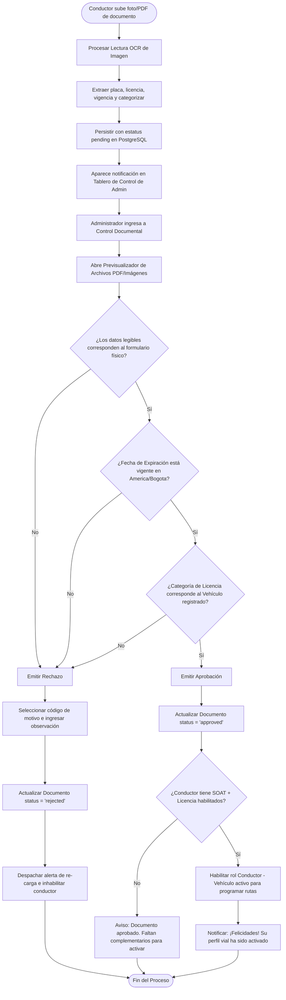

# ⚙️ Diagrama de Actividad - Aprobación Documental (Auditoría)

Este documento detalla el control, verificación cruzada y aprobación requerida para habilitar las credenciales (SOAT, Licencia y Tecno) de los conductores en Rivo.

---

## 📋 1. Ficha del Proceso de Auditoría Documental

*   **Objetivo:** Garantizar que ningún conductor circule en la plataforma sin contar con documentos estatales aprobados y vigentes.
*   **Actores:** Administrador, Servidor Backend, PostgreSQL.
*   **Tablas involucradas:** `user_documents` y `vehicle_documents`.

---

## 🗺️ 2. Diagrama de Actividad (Mermaid)

---

## 📝 3. Explicación del Flujo Operativo

1.  **Asistencia OCR:** Agiliza el alta de datos leyendo y contrastando fechas clave, minimizando errores de transcripción manual del conductor.
2.  **Seguridad Pasiva:** Las verificaciones viales cruzadas garantizan que si un conductor tiene una moto, su licencia sea de categoría `A2` y no exclusivamente `B1` (que es únicamente apta para automóviles).
3.  **Auditoría de Rechazo:** Todo rechazo exige la entrega obligatoria de una razón descriptiva para guiar al colaborador en la re-carga exitosa de su copia documental.
