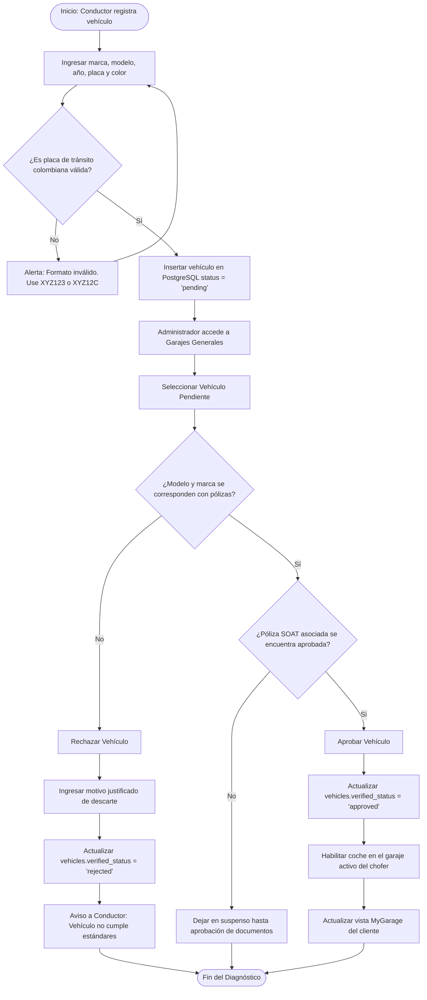

# ⚙️ Diagrama de Actividad - Habilitación de Vehículo

Este documento describe la secuencia lógica, las reglas de homologación de las características de las motocicletas y automóviles, y los casos de exclusión operativa para habilitar la flota en Rivo.

---

## 📋 1. Ficha del Proceso de Habilitación de Vehículos

*   **Objetivo:** Validar y certificar las placas y estados mecánicos de las unidades vinculadas al garaje individual del colaborador antes de su salida a rutas.
*   **Actores:** Conductor, Administrador, Motor Correlacional Rivo.
*   **Campos clave de la tabla `vehicles`:** `verified_status` ('pending', 'approved', 'rejected') y `reject_reason`.

---

## 🗺️ 2. Diagrama de Actividad (Mermaid)

---

## 📝 3. Explicación del Flujo Operativo

1.  **Formatos de Identificación Gubernamental (Vías Colombianas):** Rivo verifica de forma automática mediante validadores de Expresión Regular (`shared/validators.ts`) que las matrículas cumplan con la norma (tres letras y tres números para autos: `XYZ123`, u opcionalmente tres letras, dos números y una letra final para motocicletas: `XYZ12A`).
2.  **Abstracción de Procesos:** Un coche no se aprueba de forma independiente. Como salvaguarda de seguridad, el sistema valida que posea una póliza SOAT complementaria aprobada, previniendo resquicios de seguridad física en los trayectos.
