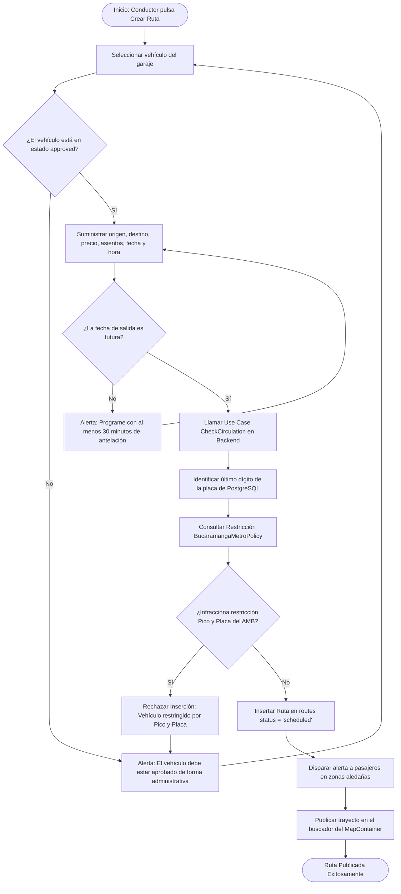

# ⚙️ Diagrama de Actividad - Creación de Ruta

Este documento modela el core del subsistema de tránsitos de Rivo: la programación segura de trayectos de carpooling evaluando el Pico y Placa de forma activa y en tiempo de ejecución.

---

## 📋 1. Ficha del Registro de Rutas

*   **Objetivo:** Agendar el trayecto de carpooling, verificar que se realice en un coche habilitado y certificar el cumplimiento de normativas de Pico y Placa del Área Metropolitana de Bucaramanga.
*   **Actores:** Conductor, Backend Express, PostgreSQL.
*   **Tabla implicada:** `routes`, con zona horaria estricta `America/Bogota`.

---

## 🗺️ 2. Diagrama de Actividad (Mermaid)

---

## 📝 3. Explicación de la Lógica "BucaramangaMetroPolicy"

1.  **Sincronización del Huso Horario:** Toda la valuación se somete de forma estricta a la zona horaria colombiana `America/Bogota` (`src/shared/timezone.ts`), solucionando inconsistencias si el backend procesa fechas en hora UTC tradicional de la nube.
2.  **Sábado Rotativo:** Se calcula el día de la semana. Especial atención se presta al sábado, donde la restricción del AMB rota y opera en horarios distintos al ciclo tradicional de lunes a viernes (ej. de 9:00 a.m. a 1:00 p.m.).
3.  **Prevención de API Directa:** No es posible sortear esta lógica realizando peticiones directas HTTPS con librerías ajenas (como curl o Postman), pues el middleware de persistencia en el backend re-comprueba la política antes de ejecutar el bloque de inserción SQL.
