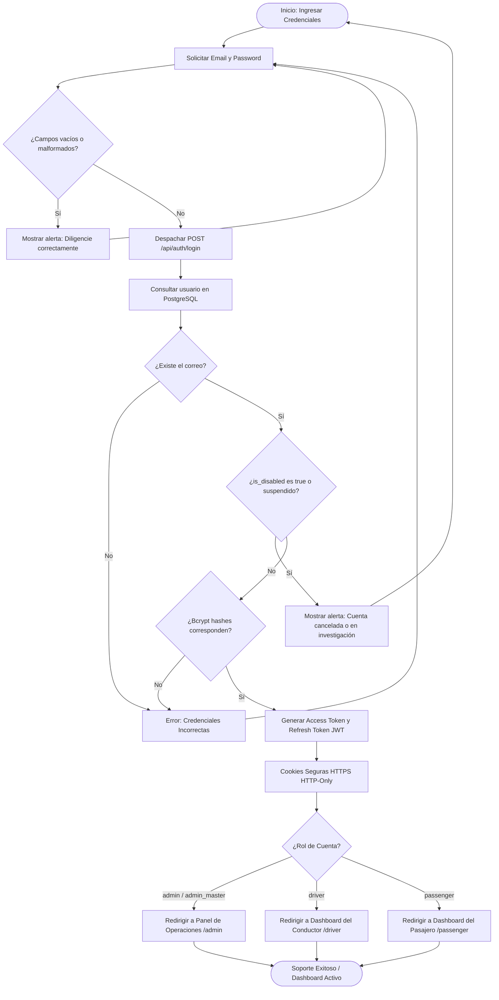

# ⚙️ Diagrama de Actividad - Inicio de Sesión (Login)

Este documento detalla el flujo de actividades lógicas, cruce de verificaciones de contraseñas, enrutamiento seguro de roles y bloqueos preventivos de cuentas inactivas en Rivo.

---

## 📋 1. Ficha del Proceso de Login

*   **Objetivo:** Autenticar inequívocamente al colaborador, evaluar su estatus operativo y dirigirlo a su consola de trabajo asignada.
*   **Actores:** Colaborador Corporativo, Frontend Web React, Backend Monolito Express, PostgreSQL.
*   **Ruta API implicada:** `POST /api/auth/login`.

---

## 🗺️ 2. Diagrama de Actividad (Mermaid)

---

## 📝 3. Explicación del Flujo Operativo

1.  **Validaciones Tempranas:** El cliente (React SPA) comprueba que los caracteres cumplan las pautas básicas del email institucional corporativo previo a consumir capacidad del backend.
2.  **Validación de Estatus:** Antes de verificar la clave, se valida que el colaborador no haya sido desactivado o suspendido por la administración mediante el booleano `is_disabled`.
3.  **Criptografía Bcryptjs:** Se procesa el hash de entrada concatenando saltings de base de datos de manera atómica.
4.  **Enrutamiento Condicional por Roles:** Dependiendo de las credenciales de rol firmadas, las guardias del enrutamiento frontend sitúan al colaborador en su espacio respectivo para evitar intrusiones no autorizadas.
