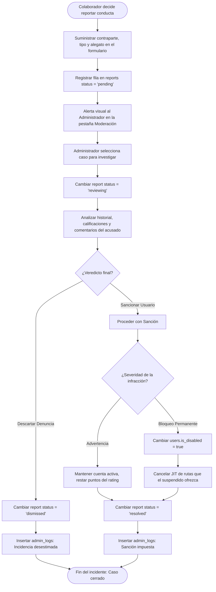

# ⚙️ Diagrama de Actividad - Moderación de Reportes

Este documento aborda las políticas de gobernanza, resolución de incidentes metropolitanos y logs de auditoría interna de control en el ecosistema Rivo.

---

## 📋 1. Ficha de Moderación y Gobernanza

*   **Objetivo:** Solucionar y catalogar controversias de uso, comportamientos inadecuados o imprudencias de conducción reportadas de forma directa.
*   **Actores:** Pasajero/Conductor denunciante, Administrador, Sistema de Auditoría.
*   **Entidades base:** `reports` y `admin_logs`.

---

## 2. Diagrama de Actividad (Mermaid)

---

## 📝 3. Explicación de la Gobernanza Rivo

1.  **Transparencia de Auditoría (`admin_logs`):** Cualquier veredicto administrativo queda registrado de forma indeleble en una bitácora de auditoría inalterable del backend, documentando qué administrador resolvió qué caso y qué sanciones fueron impuestas.
2.  **Mitigación de Efecto Cascada:** Si un conductor problemático es desactivado administrativamente, el motor de Rivo cancela condicional y atómicamente todos sus viajes agendados en estado `scheduled`, notificando instantáneamente a los pasajeros postulados para que agenden rutas alternas de inmediato.
