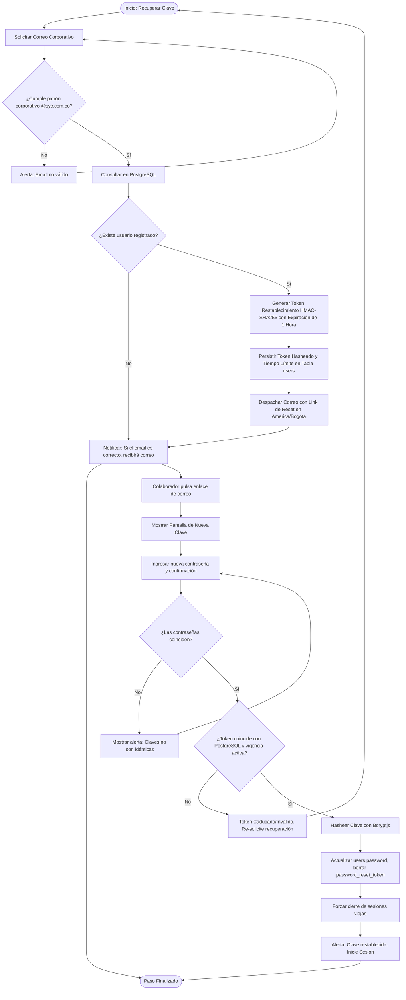

# ⚙️ Diagrama de Actividad - Recuperación de Contraseña

Este documento modela el flujo ordenado y seguro de restablecimiento de contraseñas de las cuentas de colaboradores en Rivo.

---

## 📋 1. Ficha del Restablecimiento de Credenciales

*   **Objetivo:** Permitir al colaborador reestablecer su contraseña mediante tokens seguros y verificar la titularidad del correo corporativo registrado.
*   **Actores:** Colaborador Corporativo, Interface Rivo, Base de Datos PostgreSQL.
*   **Rutas de API:** `POST /api/auth/forgot-password` y `POST /api/auth/reset-password`.

---

## 🗺️ 2. Diagrama de Actividad (Mermaid)

---

## 📝 3. Explicación del Flujo Operativo

1.  **Prevención de Exposición (Privacy Principle):** Si el email no existe, el sistema retorna un Toast genérico de éxito simulado para evitar que atacantes externos descubran correos válidos por fuerza de peticiones sistemáticas.
2.  **Expiración Forzada:** El token expira automáticamente transcurridos 60 minutos desde su generación, evitando vulnerabilidades si el buzón corporativo permanece desatendido.
3.  **Sanitización Completa:** Tras un cambio exitoso, el sistema invalida y borra permanentemente el token del registro para prevenir dobles ejecuciones.
