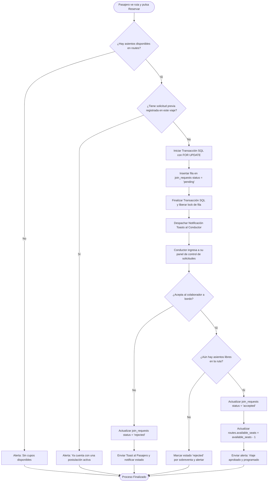

# ⚙️ Diagrama de Actividad - Solicitud de Viaje (Reserva)

Este documento describe la lógica de postulación, control de competencia de cupos, asignación atómica de puestos y notificaciones fluidas para coordinar solicitudes de viajes corporativos en Rivo.

---

## 📋 1. Ficha del Proceso de Reserva de Puestos

*   **Objetivo:** Conectar a un pasajero solicitante con el coche del conductor, gestionar las aprobaciones/rechazos y descontar asientos de forma íntegra.
*   **Actores:** Pasajero, Conductor, Servidor, Base de Datos PostgreSQL.
*   **Tablas afectadas:** `join_requests` y `routes`.

---

## 🗺️ 2. Diagrama de Actividad (Mermaid)

---

## 📝 3. Explicación del Flujo Operativo

1.  **Doble Validación:** Se evalúan los cupos disponibles una vez antes de registrar la petición (para dar visual fluida) y una última vez de forma estricta al presionar "Aprobar", blindando al sistema contra sobrecupos eventuales.
2.  **Mitigación de Competencias de Red:** El uso de transacciones con aislamiento y bloqueos a nivel de fila garantiza una sincronización libre de race conditions cotidianas en bases de datos concurrentes.
