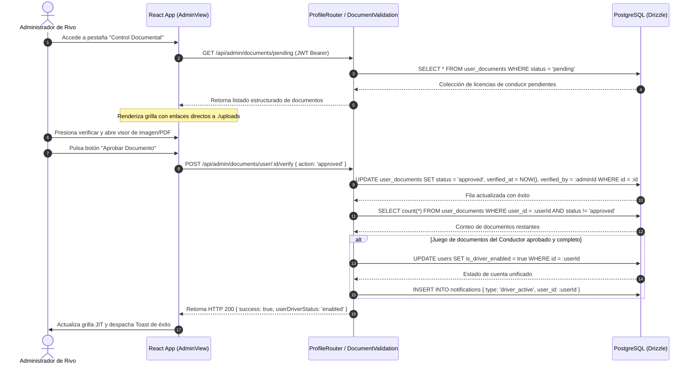

# 🔗 Diagrama de Secuencia - Aprobación Documental (Auditoría)

Este diagrama UML describe el flujo de peticiones, consumo de binarios y reconciliaciones lógicas requeridas para que la mesa de auditoría del administrador apruebe cargues de documentos viales en Rivo.

---

## 🗺️ 1. Diagrama de Secuencia (Mermaid)

---

## 📝 2. Explicación de la Lógica de Negocio

1.  **Doble Entrada de Seguridad:** La base de datos guarda por separado la fecha en la que se habilitó la documentación (`verified_at`) y el identificador administrativo (`verified_by`) responsable del visto bueno para simplificar auditorías de riesgos internos organizacionales.
2.  **Habilitación en Cascada:** Al aprobarse la última credencial obligatoria pendiente de un colaborador, el backend actualiza de manera autogestionada el estatus global del perfil para permitir la creación inmediata de rutas metropolitanas compartidas.
