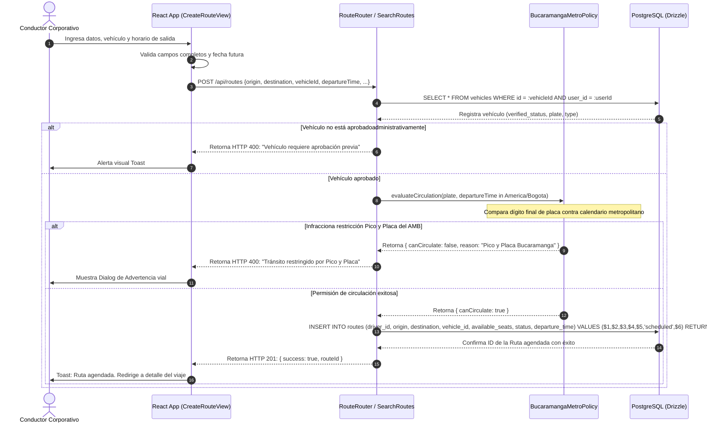

# 🔗 Diagrama de Secuencia - Creación de Ruta

Este diagrama UML describe el flujo temporal, la zona horaria colombiana, las llamadas al caso de uso de verificación de Pico y Placa y la inserción final en la base relacional de datos de las rutas viales en Rivo.

---

## 🗺️ 1. Diagrama de Secuencia (Mermaid)

---

## 📝 2. Detalle de Integración del Sistema

1.  **Validaciones Tipo Servidor:** Las restricciones estatales no se confían a la capa visual del cliente, debido a que horarios falsificados en la laptop del usuario podrían bypassar localmente los controles. Se validan con precisión de reloj en el micro-motor de la clase `CheckCirculation`.
2.  **Mitigación de Errores de Zonas de Servidores:** El backend traduce JIT los formatos UTC de heroku, aws o nube al huso horario metropolitano (`America/Bogota`) antes de procesar las comparencias de tránsito locales.
