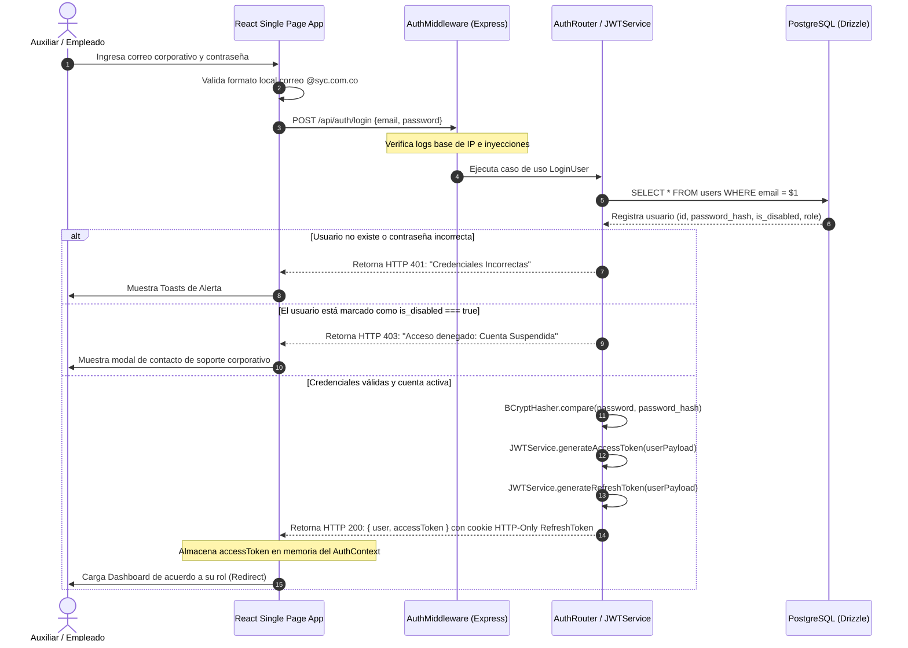

# 🔗 Diagrama de Secuencia - Inicio de Sesión (Login)

Este diagrama UML de secuencia detalla el mapa cronológico, traspaso de cabeceras de red, desencadenamiento de middlewares de seguridad y la persistencia de cookies en el proceso de autenticación de Rivo.

---

## 🗺️ 1. Diagrama de Secuencia (Mermaid)

---

## 📝 2. Puntos Clave de Seguridad en la Secuencia

1.  **Aislamiento de Refresh Tokens:** Al custodiarse los tokens de refresco bajo directiva de seguridad **HTTP-Only**, se previene cualquier robo por inyección de código cruzado (XSS) en la interfaz del cliente.
2.  **Mantenimiento Stateless:** Las peticiones consiguientes consumen el token de acceso directo desde las cabeceras REST, sorteando la exigencia de consultar persistentemente la base para validar los accesos a los recursos del sistema.
