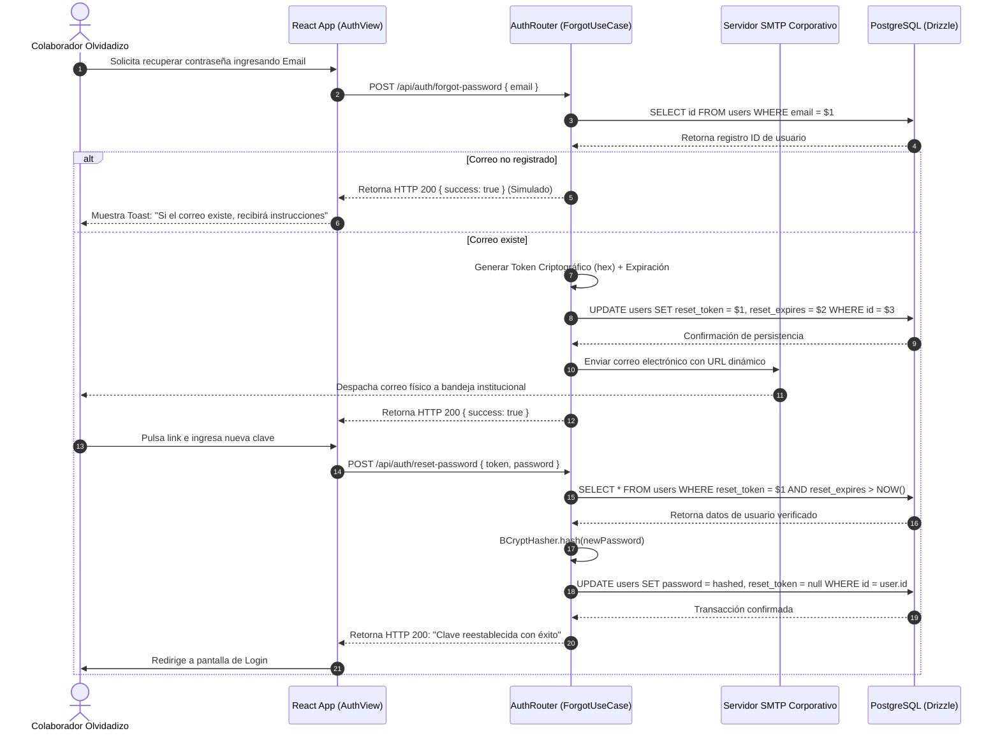

# 🔗 Diagrama de Secuencia - Recuperación de Contraseña

Este documento expone la interacción asíncrona, flujos temporales de tokens y transacciones de base de datos llevadas a cabo al solicitar un restablecimiento de clave en Rivo.

---

## 🗺️ 1. Diagrama de Secuencia (Mermaid)

---

## 📝 2. Explicación del Traspaso de Mensajes

1.  **Protección de Token Estático:** El backend almacena únicamente una representación hasheada del token de recuperación, mitigando fugas si la persistencia de base de datos sufre una vulneración.
2.  **Mitigación de Respuestas Variadas:** El sistema retorna HTTP 200 idéntico, demorando milisegundos semejantes gracias a demoras controladas para blindar al sistema de ataques de enumeración e identificación de cuentas de colaboradores corporativos.
