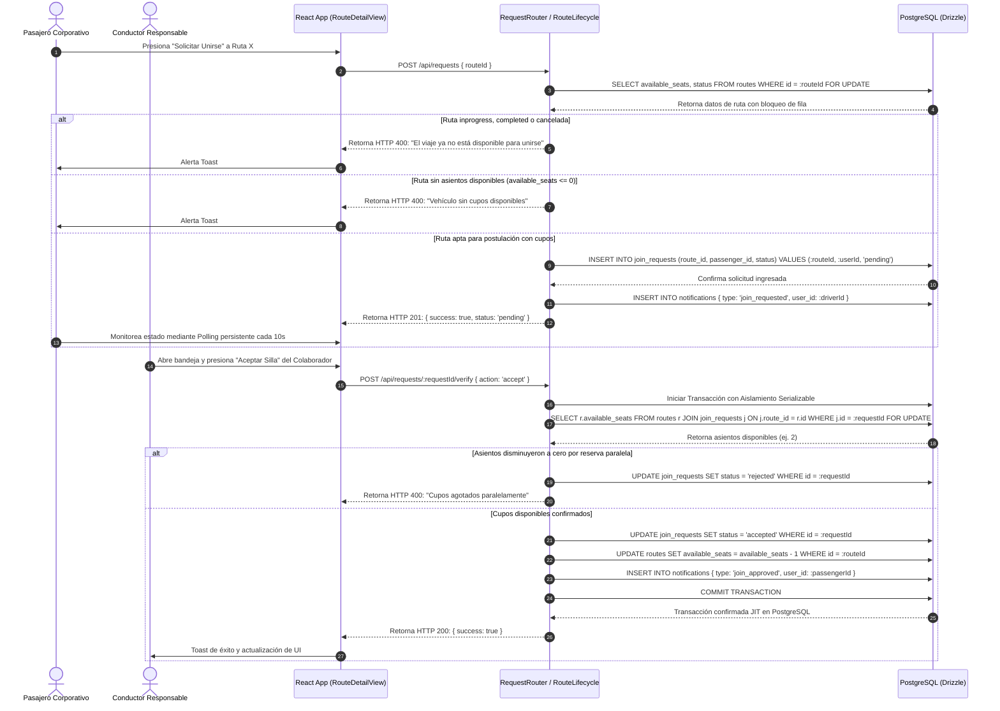

# 🔗 Diagrama de Secuencia - Solicitud de Viaje (Reserva)

Este diagrama UML detalla el flujo de interacciones, pasos atómicos para mitigar la sobreventa concurrente de sillas, control de estados de solicitudes y sincronización posterior mediante polling en Rivo.

---

## 🗺️ 1. Diagrama de Secuencia (Mermaid)

---

## 📝 2. Explicación de la Lógica Sincronizada

1.  **Bloqueo de Fila Transaccional:** Al forzar un aislamiento estricto en la base Postgres, Rivo erradica inconsistencias que surgen cuando dos pasajeros pujan de manera simultánea por el último boleto libre, garantizando un cupo justo por orden de llegada.
2.  **Notificaciones Proactivas:** Las uniones exitosas disparan la persistencia en las tablas coordinadoras de alertas para que el pasajero reciba la confirmación visible en su siguiente ciclo de polling automático en el frontend.
