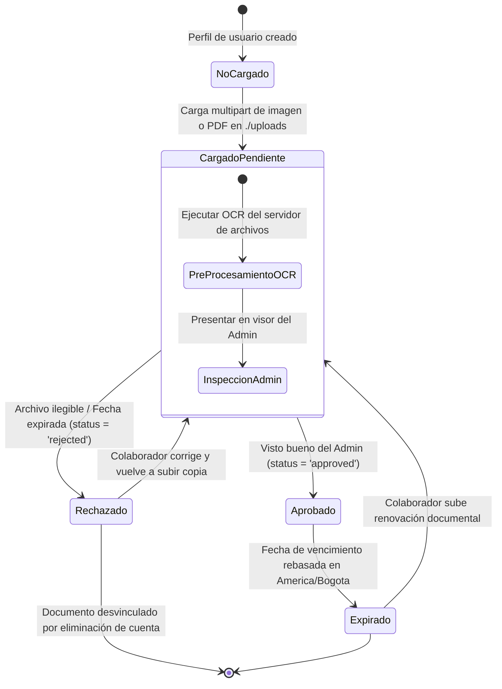

# 🔄 Diagrama de Estado - Documento (User/Vehicle Documents)

Este documento modela el ciclo de vida y controles de aprobación que regulan la validez de los expedientes físicos y digitales (SOAT, Licencia y revisiones tecnomecánicas) de Rivo.

---

## 🗺️ 1. Máquina de Estados de los Documentos (Mermaid)

---

## 📝 2. Explicación de los Estados

1.  **No Cargado (`no_uploaded`):** Por defecto para perfiles iniciales de pasajeros. No posee rastro físico en `./uploads` ni registro en base de datos.
2.  **Aprobado (`approved`):** Certificación plena y legítima en base de datos de control. Permite habilitar los llamados del conductor.
3.  **Expirado (`expired`):** Comprobación sistemática de tiempo. Cuando el reloj rebasa de forma transcurrida la fecha de expiración, el backend degrada preventivamente el estado del conductor, impidiéndole ofrecer nuevos viajes a la comunidad de carpooling corporativo.
