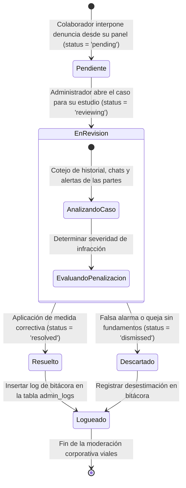

# 🔄 Diagrama de Estado - Reportes e Incidencias (Reports)

Este documento modela el recorrido lógico para solucionar quejas, incidencias o comportamientos inadecuados reportados por la comunidad vial de Rivo.

---

## 🗺️ 1. Máquina de Estados del Reporte (Mermaid)

---

## 📝 2. Explicación del Ciclo de Moderación

1.  **Pendiente (`pending`):** El incidente se registra. Aparece de forma colorida y parpadeante en la consola visual del administrador reclamando atención asertiva.
2.  **En Revisión (`reviewing`):** Simboliza que el equipo de soporte corporativo está investigando las evidencias, bloqueando dobles revisiones simultáneas de administradores para el mismo caso.
3.  **Resuelto (`resolved`):** El caso se cierra decretando una advertencia sistemática, degradación del rating del infractor, o suspensión forzada de su ingreso seguro a Rivo.
4.  **Descartado (`dismissed`):** Incidencias sin soporte documental o que resultaran ser malos entendidos del carpooling, devolviendo la regularidad operativa regular.
