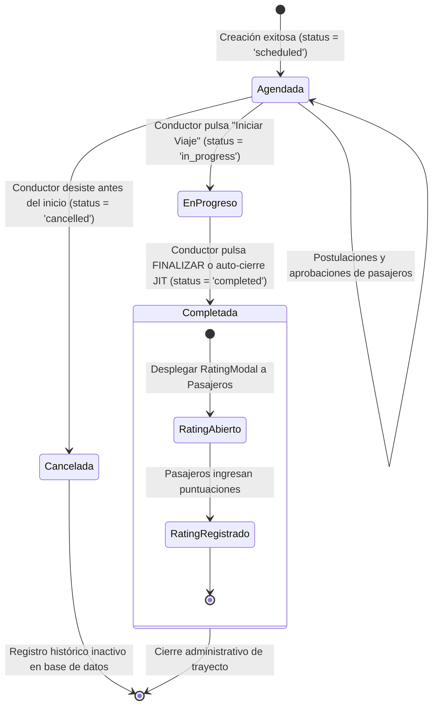

# 🔄 Diagrama de Estado - Ruta (Routes)

Este documento detalla el ciclo lógico de estados de un viaje programado por un conductor, desde su publicación hasta su finalización automática (JIT) e interacción de feedback en Rivo.

---

## 🗺️ 1. Máquina de Estados de la Ruta (Mermaid)

---

## 📝 2. Explicación de los Estados de Rutas

1.  **Agendada (`scheduled`):** Ruta activa visible en el `MapContainer` y buscador de trayectos de Rivo. Permite postulaciones dinámicas.
2.  **En Progreso (`in_progress`):** El viaje ha partido físicamente. En este estado se cierran las reservas de forma rígida, impidiendo que pasajeros se suban al viaje de manera tardía.
3.  **Completada (`completed`):** El viaje concluyó. Se abre el panel interactivo de evaluación calificada, acumulando estrellas y reputación en el perfil del conductor en PostgreSQL de forma atómica.
4.  **Auto-finalización temporal JIT (Just-In-Time):** Si un conductor olvida actualizar el estatus de su trayecto, el motor backend asume de forma autónoma el estado de `completed` transcurridas 3 horas desde la hora de salida original, protegiendo las estadísticas y métricas del sistema.
