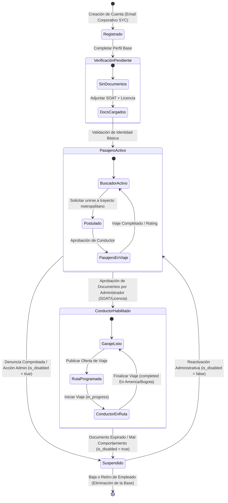

# 🔄 Diagrama de Estado - Usuario (Users)

Este documento describe el modelo de transición de estados y bloqueos que gobiernan las cuentas de los colaboradores de SYC corporativos bajo el monolito Rivo.

---

## 🗺️ 1. Máquina de Estados del Usuario (Mermaid)

---

## 📝 2. Explicación de Transiciones de Negocio

1.  **Elevación de Rol Condicionada:** Un colaborador nuevo siempre inicia en Rivo bajo estatus plano de Pasajero por defecto. El ascenso y habilitación al estado de Conductor está firmemente condicionado a que la verificación documental arroje veredicto positivo por parte de la mesa de control de un administrador.
2.  **Mitigación de Accesos a Cuentas Suspendidas:** En el momento exacto en que un usuario es transicionado administrativamente al estado de `Suspendido` (`is_disabled = true` en base de datos), su Bearer Token de sesión es invalidado por el `authMiddleware` en el siguiente consumo de API de red.
3.  **Transiciones del Negocio JIT:** Durante la ejecución de un viaje exitoso, la máquina de estados transiciona dinámicamente de postulación a trayecto en marcha, cerrando con modales participativos de evaluación de comunidad.
