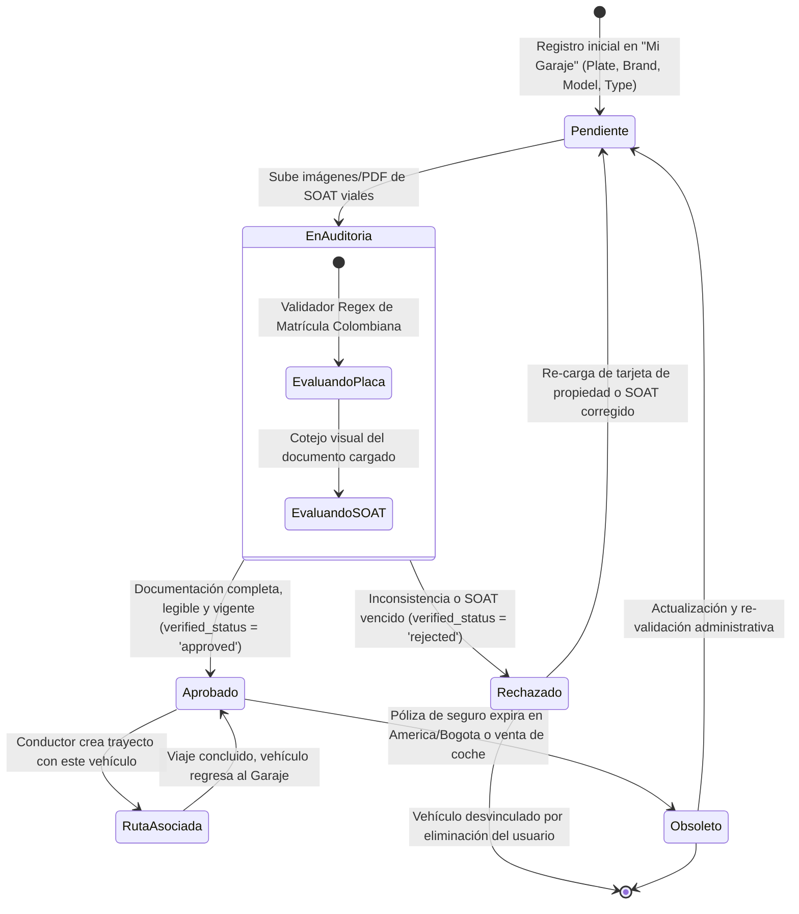

# 🔄 Diagrama de Estado - Vehículo (Vehicles)

Este documento modela el ciclo de vida de los vehículos que los conductores registran e inscriben en el garaje general corporativo de Rivo.

---

## 🗺️ 1. Máquina de Estados del Vehículo (Mermaid)

---

## 📝 2. Explicación de los Estados Viales

1.  **Pendiente (`pending`):** Estado inicial temporal de registro. Mientras persista bajo esta condición en base, Rivo invalida en backend cualquier llamado REST para programar trayectos con este vehículo.
2.  **Aprobado (`approved`):** El coche es certificado por el administrador. Habilita los llamados del creador de rutas lógicas y desactiva las alarmas de flota del dashboard del colaborador.
3.  **Rechazado (`rejected`):** Almacena de manera obligatoria una justificación técnica o de legibilidad de pólizas, informando al usuario en su sección de garaje para corregir su estatus de tránsito corporativo.
