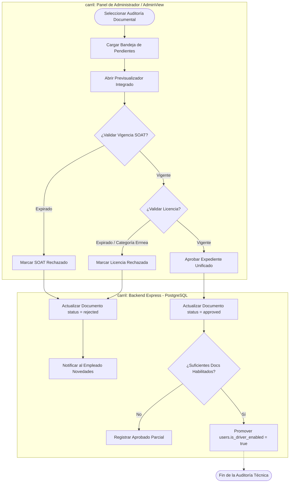

# 🗺️ BPMN - Validación Documental (Auditoría Técnica)

Este documento modela las compuertas, tareas secuenciales, control y flujos de mitigación jurídica llevados a cabo al auditar un portafolio documental (SOAT y Licencia de Conducir) en Rivo.

---

## 🗺️ 1. Diagrama del Subproceso (Mermaid BPMN)

---

## 📝 2. Explicación de las Tareas de Control

1.  **Evaluaciones Secuenciales Mandatorias:** El administrador sigue un orden lógico: primero valida el SOAT del auto (requerido para cobertura en caso de incidentes) y posteriormente la idoneidad legal individual del conductor (Licencia).
2.  **Automatización de Elevación de Rol:** El backend calcula de manera atómica si el nuevo aprobado completa el portafolio, promoviendo al colaborador al rol Conductor al instante sin necesidad de clics complementarios por parte de la mesa de soporte.
