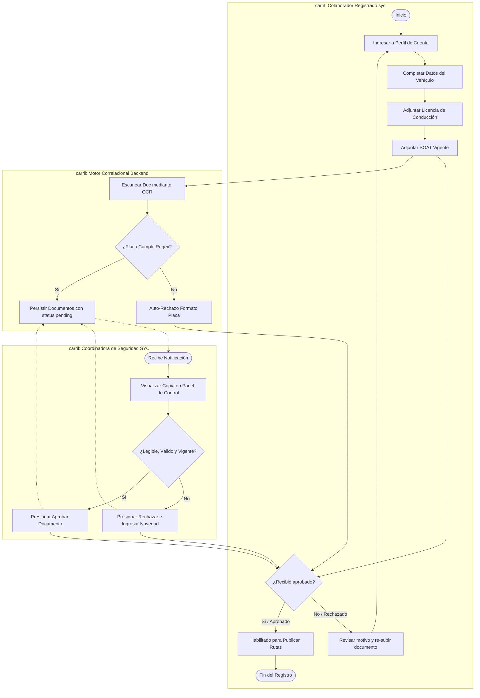

# 🗺️ BPMN - Registro del Conductor (Habilitación Vial)

Este documento detalla el subproceso BPMN para registrar y dar de alta a un Conductor Corporativo en Rivo, incorporando las tareas, compuertas lógicas y controles cruzados de seguridad y tránsito.

---

## 🗺️ 1. Diagrama del Subproceso (Mermaid BPMN)

---

## 📝 2. Explicación de los Elementos del Subproceso

1.  **Validaciones Tipo Regex:** Reduce la carga al evitar que placas inexistentes o que no correspondan con la nomenclatura colombiana viales colapsen el buzón de la mesa de control del administrador.
2.  **Transparencia de Feedback:** En caso de rechazo, se interrumpe la transición del rol del colaborador, evitando que ofrezca plazas viales hasta que se realicen las acciones correctivas pertinentes.
