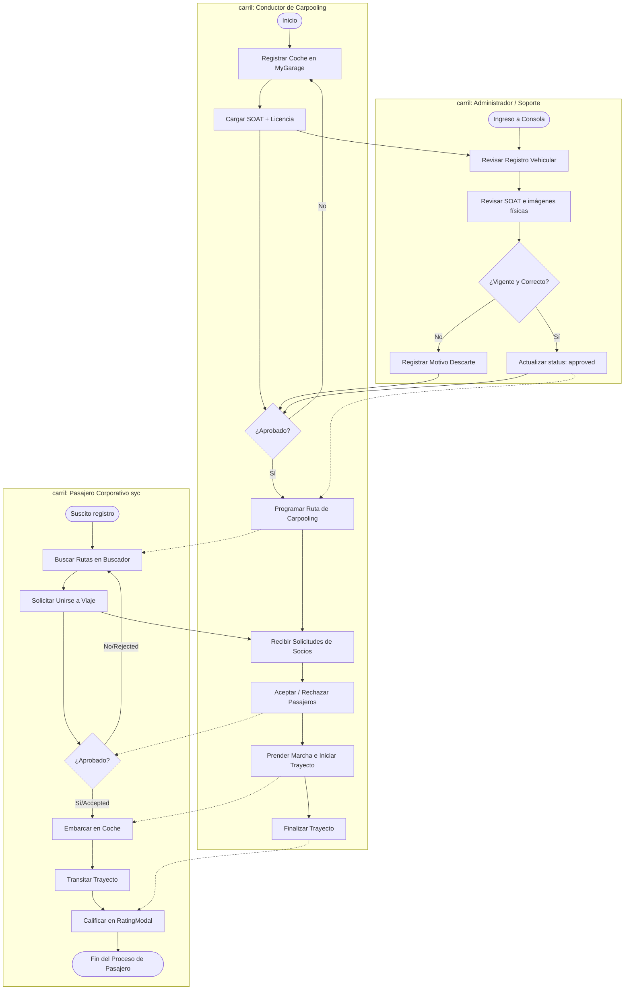

# 🗺️ 06 - BPMN: Proceso General Unificado de Rivo

Este diagrama BPMN de nivel horizontal modela el flujo integrado de negocio cruzando los carriles y responsabilidades secuenciales de todos los participantes de Rivo.

---

## 🗺️ 1. Diagrama de Proceso General (Mermaid BPMN)

---

## 📝 2. Explicación del Tránsito Corporativo

1.  **Colaboración de Carriles:** El BPMN demuestra visualmente cómo el viaje depende de aprobaciones sistemáticas mutuas para el correcto engranaje de la plataforma de carpooling de SYC.
2.  **Soporte Operativo Activo:** El carril administrativo custodia las precondiciones legales, mientras que las operaciones cotidianas de creación y reserva viales fluyen de extremo a extremo sin demandar intervención sistemática rutinaria.
