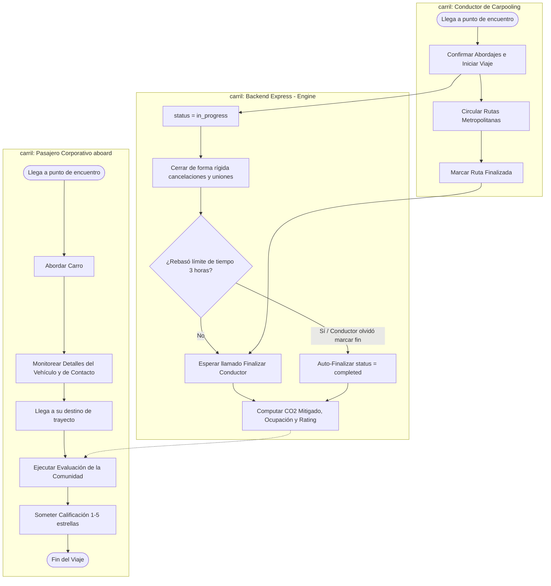

# 🗺️ BPMN - Ejecución de Viaje Completo (Viaje Seguro)

Este subproceso modela de manera exhaustiva el recorrido y coordinación de un trayecto desde que el vehículo se encuentra con tripulación asignada hasta su arribo de destino corporativo en Rivo.

---

## 🗺️ 1. Diagrama del Subproceso (Mermaid BPMN)

---

## 📝 2. Explicación del Tránsito Compartido

1.  **Cierre Inmediato de Reservas:** Al cambiar el viaje al estado `in_progress`, el sistema blinda al vehículo de reservas tardías no coordinadas en el tramo de circulación vial de SYC.
2.  **Resiliencia Analítica (Auto-Finalizer):** Para evitar que viajes queden estancados de forma indeterminada distorsionando las estadísticas ejecutivas corporativas de carpooling, el auto-finalizador JIT concilia el trayecto de manera autónoma.
3.  **Encadenamiento de Evaluación:** Sanciona o fortalece la reputación comunitaria de los choferes mediante la acumulación de ponderados de estrellas recogidos por el `RatingModal`.
