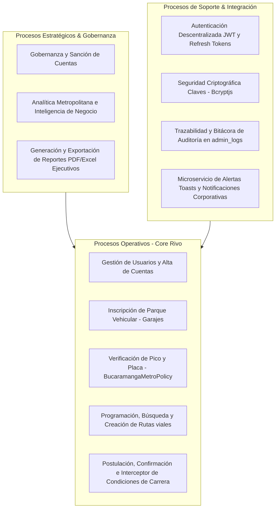

# 📊 07 - RIVO: Mapa de Procesos de la Plataforma

Este mapa de procesos asocia las competencias del monolito de Rivo, organizando las lógicas en tres tipologías de procesos de negocio corporativos para Sistemas y Computadores SYC S.A.

---

## 🗺️ 1. Diagrama de Mapa de Procesos (Mermaid)

---

## 📝 2. Taxonomía de Procesos de Rivo

### 2.1. Procesos Estratégicos (Gobernanza y Analítica)
*   Representan el control directivo del sistema de movilidad de SYC.
*   **Decisiones:** Permite estudiar cifras de mitigación ecológica, resolver reportes e incidencias vecinales y configurar roles de los colaboradores.
*   **Consumo SQL:** Consultas agregadas de rendimiento de ocupación vial.

### 2.2. Procesos Operativos (Core del Negocio)
*   Engloban a las funciones cotidianas necesarias para que exista el carpooling.
*   **Acciones:** Creación de carpooling, validación metropolitana de Pico y Placa en `America/Bogota` de forma coordinada, resguardo de cupos ante race conditions e incorporación de vehículos en el garaje general.
*   **Consumo SQL:** Escritura transaccional y bloqueos `FOR UPDATE` en PostgreSQL.

### 2.3. Procesos de Soporte (Mallas de Respaldo)
*   Suministran la base de seguridad lógica y control exigidos para operar sin vulnerabilidades cibernéticas.
*   **Especialidades:** Hasheo criptográfico en Bcryptjs, despacho de notificaciones y segregación mediante bitácora de auditorías (`admin_logs`).
